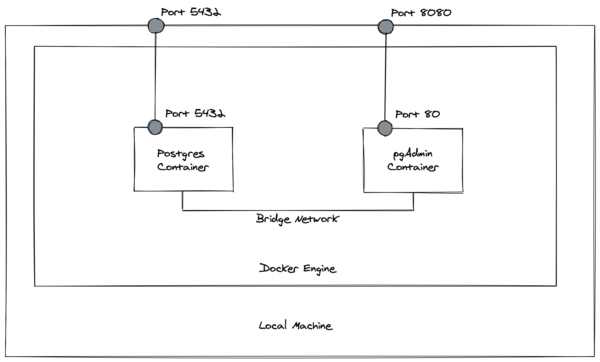

# London Koders Dockerised Postgres

This project contains Docker files to launch containers to facilitate some SQL exercises.

## Requirement
- Docker Engine v19.03.0+
- Docker Compose v1.27.0+

## Running the project
Command `docker-compose up` in project root will launch:
- Postgres container with port mapped to 5432 on localhost
- pgAdmin container with port mapped to 8080 on localhost

You can browse to `localhost:8080` and login to pgAdmin with username 'koders@example.com' and password 'koders'.

Within pgAdmin, you can connect to the Postgres via hostname `koders-pg`, with username and password both `postgres`.

Run `docker-compose down --rmi local -v` to clean up.

## Diagram for the Composed Containers

